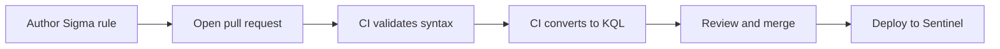

# Detection as Code

> Treating detections like software: version-controlled Sigma rules, automated validation in CI, and conversion to platform queries on every commit.


## The idea

Most detection content lives as copy-pasted queries in a SIEM console with no history, no review, and no testing. When something breaks, nobody knows what changed or why. Detection as code fixes that by borrowing the practices software engineering settled decades ago: write detections in a portable format, store them in version control, review changes through pull requests, and validate everything automatically before it merges.

This repository is my working model of that workflow. A detection enters as a Sigma rule, gets syntax-checked and converted to KQL by a CI pipeline, and only merges once it passes. The history of every detection, and every tuning change, is preserved.

## Why this matters for a SOC

- **Portability.** A Sigma rule converts to Sentinel KQL, Defender XDR, Elastic, or Splunk. Write once, deploy to many backends.
- **Review.** Detection changes go through pull requests, so logic is peer-reviewed, not silently edited in a console.
- **Testing.** Broken syntax never reaches production because CI catches it first.
- **Auditability.** Git history is a complete, timestamped record of what changed and when, which matters in any compliance-driven environment.

## How a detection moves through the pipeline



## Repository structure

```
detection-as-code/
  rules/
    credential-access/
      brute-force-single-account.yml
      oauth-consent-grant.yml
      password-spray.yml
    persistence/
      suspicious-inbox-rule.yml
  tests/
    test_rule_requirements.py    # pytest: every rule meets CONTRIBUTING.md
  .github/
    workflows/
      validate-detections.yml    # CI: requirements, validate, convert
  pipelines/
    sentinel.yml                 # pySigma pipeline: one table per log source
  build/
    kql/                         # generated queries (CI output)
  requirements.txt               # pinned Sigma tooling and test dependencies
```

## A detection in Sigma

This is the same password-spray logic from my [detection-engineering](https://github.com/edwardjgriggs/detection-engineering) repo, written once in a portable, backend-agnostic format.

```yaml
title: Azure AD Password Spray From Single Source
id: 7f1c2e90-3b4a-4d77-9b21-2c6f5a8e1d44
status: experimental
description: >
  Detects a single source address failing authentication across many
  distinct accounts in a short window, the signature of a password spray.
references:
  - https://attack.mitre.org/techniques/T1110/003/
author: Edward Griggs
date: 2026/06/23
logsource:
  product: azure
  service: signinlogs
detection:
  selection:
    ResultType:
      - '50126'   # invalid username or password
      - '50053'   # account locked
  condition: selection
  timeframe: 30m
fields:
  - IPAddress
  - UserPrincipalName
  - ResultType
falsepositives:
  - Shared corporate egress IP behind NAT
  - Applications replaying stale credentials
level: high
tags:
  - attack.credential-access
  - attack.t1110.003
```

## The CI pipeline

On every pull request that touches a rule, the pipeline, or the tests, GitHub Actions checks the rule requirements, validates the Sigma syntax, and converts the rules to KQL. Nothing merges if any step fails.

```yaml
name: validate-detections

on:
  pull_request:
    paths:
      - 'rules/**'
      - 'pipelines/**'
      - 'tests/**'
      - 'requirements.txt'
      - '.github/workflows/validate-detections.yml'
  push:
    branches: [ main ]

jobs:
  validate:
    runs-on: ubuntu-latest
    steps:
      - name: Check out repository
        uses: actions/checkout@v7

      - name: Set up Python
        uses: actions/setup-python@v7
        with:
          python-version: '3.12'

      - name: Install Sigma tooling
        run: pip install -r requirements.txt

      - name: Check rule requirements
        run: pytest -q

      - name: Validate rule syntax
        run: sigma check rules/

      - name: Convert rules to KQL
        run: |
          mkdir -p build/kql
          sigma convert -t kusto -p pipelines/sentinel.yml rules/ -o build/kql/detections.kql

      - name: Upload generated queries
        uses: actions/upload-artifact@v7
        with:
          name: kql-detections
          path: build/kql/
```

The conversion step emits one query per rule, prefixed with the table its log source maps to in `pipelines/sentinel.yml`:

```kql
AuditLogs
| where OperationName =~ "Consent to application" and Result =~ "success"
```

> Note: the conversion is verified against the tool versions pinned in `requirements.txt` (sigma-cli 3.1.0, pysigma-backend-kusto 1.0.1). The kusto backend only prepends a table when one of its bundled pipelines is used, so this repo's pipeline does it with a postprocessing template. Re-check the output after upgrading either package.

## Testing strategy

Syntax validation is the floor, not the ceiling. The roadmap extends CI toward behavioral confidence:

1. **Syntax and schema validation** (implemented): every rule is a well-formed Sigma rule.
2. **Rule requirement checks** (implemented): `pytest` enforces a stable UUID, an ATT&CK reference and tag, false positive notes, and a log source the pipeline knows how to map to a table.
3. **Field validation** (roadmap): referenced fields exist in the target log schema.
4. **Conversion verification** (implemented): every rule compiles to KQL against the correct table.
5. **Detection testing** (roadmap): pair each rule with an Atomic Red Team test and assert the converted query returns the expected event in lab data.

## What this demonstrates

- Detection engineering past the query: lifecycle, version control, and automation
- Practical CI/CD with GitHub Actions applied to security content
- Sigma and pySigma fluency for backend-portable detections
- The engineering maturity that separates a detection engineer from a rule writer

## About

Built and maintained by Edward Griggs. Security+ certified, SC-200 in progress, building toward a detection engineering role from a systems and security administration foundation.

[LinkedIn](https://www.linkedin.com/in/edward-griggs/) · [GitHub](https://github.com/edwardjgriggs)
